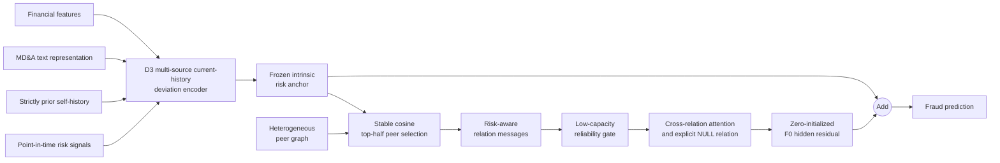

# Risk-Aware Financial Fraud Detection

**Multi-Source Risk-Aware Graph Learning for Financial Statement Fraud Detection**

Master's thesis research project at Shanghai University of Finance and Economics. This repository is a compact recruiting and research showcase by [RookieZhou0617](https://github.com/RookieZhou0617).

> **Research status:** model development is closed. The frozen thesis framework is **D3 + F0**: a multi-source current-history intrinsic risk anchor plus a conservative, anchor-preserving relational residual. The single fixed-protocol 2022 OOT evaluation has been completed; no post-OOT model modification is permitted.

## Overview

Financial statement fraud detection depends on more than a company's own financial performance. Listed companies are connected through shareholders, auditors, related-party transactions, investments, supply chains, people, and organizations. These heterogeneous relations may reveal risk patterns that isolated tabular models cannot see.

Yet unrestricted graph neural networks can propagate noisy neighbors and overwrite a strong company-level fraud representation. This project asks: **how can heterogeneous relational information provide incremental value without damaging a strong multi-source fraud-risk anchor?**

## Frozen framework

The final framework treats graph information as a conservative correction:

$$
h_{\text{final}} = h_{\text{D3}} + \Delta h_{\text{F0}}.
$$

- **D3 multi-source risk anchor** combines financial features, an MD&A text representation, self-history, and point-in-time risk signals.
- **Current-history deviation** represents signed change, absolute change, interaction, and cosine similarity against strictly prior company states.
- **Stable peer selection** retains the top `ceil(n/2)` peers by frozen-anchor cosine similarity, with deterministic tie handling.
- **Risk-aware relation messages** describe each selected peer relative to the target's hidden state and intrinsic risk.
- **Relation reliability gate** uses label-free peer and context statistics to suppress unreliable evidence.
- **NULL-aware cross-relation fusion** can abstain when no relation is useful.
- **Zero-initialized hidden residual** preserves D3 exactly at initialization; D3 remains frozen while F0 learns only a graph correction.

## Architecture



## Strict temporal evaluation

Random splitting is unsafe in this setting because it can mix future regimes, fitted preprocessing, labels, and historical risks into model development. The research used expanding, fold-specific temporal evaluation:

| Train | Validation | Future development fold |
|---|---:|---:|
| 2014–2016 | 2017 | 2018 |
| 2014–2017 | 2018 | 2019 |
| 2014–2018 | 2019 | 2020 |
| 2014–2019 | 2020 | 2021 |

Model exploration was closed before final 2022 access. The final fixed protocol used 2016–2020 for selection training, 2021 for validation, 2016–2021 for refitting, and 2022 only for the terminal OOT evaluation. Cross-fitted historical risks and every fitted transform obey their point-in-time boundary. See [the strict temporal protocol](docs/strict_temporal_protocol.md).

## Final evidence

### 2018–2021 development folds

The frozen F0-minus-D3 AUC-PR changes were:

| 2018 | 2019 | 2020 | 2021 | Four-year mean |
|---:|---:|---:|---:|---:|
| +0.000142 | -0.012589 | +0.002565 | +0.014009 | +0.001032 |

The mixed signs are important: F0 was retained as the conservative relational extension, not because it was uniformly better in every development year. Multiple proposed repairs and more complex aggregation, gating, temporal, fusion, and objective variants did not earn promotion under their preregistered rules.

### Final fixed-protocol 2022 OOT

Primary results are five-seed mean AUC-PR:

| Frozen arm | Mean AUC-PR | Difference |
|---|---:|---:|
| D3 intrinsic anchor | 0.489256 | — |
| F0 with real relations | 0.507052 | +0.017797 vs D3 |
| F0 with matched shuffled relations | 0.489639 | +0.017414 real vs shuffle |

Both comparisons were positive in **5/5 seeds**. However, paired bootstrap 95% intervals were `[-0.017470, 0.056282]` for F0 vs D3 and `[-0.017450, 0.055039]` for real vs shuffled relations. Both cross zero, so this is directionally positive OOT evidence with substantial uncertainty—not a claim of statistical significance or proven temporal robustness.

The ensemble F0 AUC-PR was `0.507894` versus `0.492451` for D3. F0 improved AUC-ROC and LogLoss, but Recall@5% decreased from `0.821138` to `0.813008`; Recall@10% was unchanged at `0.878049`. The result is therefore not presented as an across-the-board metric improvement. See [the evidence summary](docs/experiments.md).

## Research findings

1. A strong intrinsic risk representation should be protected from unrestricted graph propagation.
2. Real relational structure can carry incremental fraud-risk information beyond the intrinsic anchor.
3. Relational utility is conditional and can reverse across years; F0 retains genuine temporal heterogeneity.
4. Conservative hidden-state residual correction was retained over unrestricted joint training and more elaborate alternatives.
5. Stable relation availability does not imply stable predictive contribution, and no reliable inference-time utility selector was established.
6. The final OOT result supports the direction of D3 + F0, while its uncertainty and metric trade-offs constrain the strength of the claim.

## Quick start

```bash
python -m venv .venv
source .venv/bin/activate
pip install -r requirements.txt
python examples/synthetic_demo.py
```

The demo generates only synthetic company features, histories, risks, relations, and labels. It validates the public D3 + F0 model path, deterministic peer selection, loss computation, and one graph-only optimization step; it does not reproduce the thesis results.

## Repository structure

```text
src/models/       compact D3 and F0 model components
src/data/         strict temporal split and cross-fitting helpers
src/utils/        evaluation metrics
configs/          small public example configuration
examples/         runnable synthetic demonstration
docs/             methodology and evidence notes
```

## Dataset

The research is based on [FiGraph](https://github.com/XiaoguangWang23/FiGraph), a dynamic heterogeneous graph dataset for financial anomaly detection. See the [official paper](https://doi.org/10.1145/3701716.3715301) for its construction and citation.

FiGraph data is **not redistributed here**. Obtain it from the original authors or official source and follow its license and usage terms, including its non-commercial-use restriction.

## Repository scope

This public repository is a clean research showcase. It contains a compact reimplementation of the frozen model design, strict-temporal utilities, a synthetic runnable example, and aggregate methodology/evidence documentation.

It intentionally excludes raw or processed FiGraph data, labels, sample-level predictions, checkpoints, private thesis artifacts, complete experiment history, thesis drafts, and internal research prompts. It is not a one-command reproduction package for the private thesis pipeline.

## License status

Code is provided for research and portfolio demonstration. Licensing will be clarified with the final thesis release. No ownership is claimed over FiGraph data or third-party resources.

For a shorter Chinese introduction, see [README_CN.md](README_CN.md).
