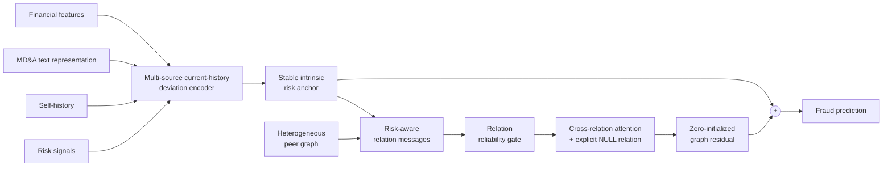

# Risk-Aware Financial Fraud Detection

**Multi-Source Risk-Aware Graph Learning for Financial Statement Fraud Detection**

Master's thesis research project at Shanghai University of Finance and Economics. This repository is a compact recruiting and research showcase by [RookieZhou0617](https://github.com/RookieZhou0617).

## Overview

Financial statement fraud detection depends on more than a company's own financial performance. Listed companies are connected through shareholders, auditors, related-party transactions, investments, supply chains, people, and organizations. These heterogeneous relations may reveal risk patterns that isolated tabular models cannot see.

Yet unrestricted graph neural networks can propagate noisy neighbors and overwrite a strong company-level fraud representation. This project asks: **how can heterogeneous relational information provide stable incremental value on top of a strong multi-source fraud-risk model?**

## Key idea

The model treats graph information as selective incremental evidence:

$$
h_{\text{final}} = h_{\text{intrinsic}} + \Delta h_{\text{graph}}.
$$

- **Multi-source risk encoder** combines financial features, an MD&A text representation, self-history, and risk signals.
- **Current-history deviation** represents signed change, absolute change, interaction, and cosine similarity against strictly prior company states.
- **Risk-aware relation messages** describe each peer relative to the target's hidden state and intrinsic risk.
- **Relation reliability gate** uses label-free peer and context statistics to suppress unreliable evidence.
- **NULL-aware cross-relation fusion** can abstain when no relation is useful.
- **Zero-initialized graph residual** begins as an exact no-graph model and learns only a correction.

## Architecture



## Strict temporal evaluation

Random splitting is inappropriate for this setting because it can mix future regimes, learned preprocessing, labels, and historical risks into model development. The research uses expanding temporal folds:

| Train | Validation | Future development fold |
|---|---:|---:|
| 2014–2016 | 2017 | 2018 |
| 2014–2017 | 2018 | 2019 |
| 2014–2018 | 2019 | 2020 |
| 2014–2019 | 2020 | 2021 |

Cross-fitted historical risk estimates are generated only from earlier information, and every fitted transform follows its fold-specific causal boundary. See [the strict temporal protocol](docs/strict_temporal_protocol.md).

## Current development result

On the 2018–2021 strict-temporal development folds, the current selective graph model achieved an average AUC-PR improvement of approximately **0.006** over the no-graph current-history backbone. It improved three of four years.

This result did **not** pass every preregistered stability gate: the worst-year change and cross-seed consistency were insufficient. It is therefore presented as development evidence, not as a significant, state-of-the-art, independent final OOT, or finalized-thesis claim. The 2022 snapshot is not used as the public development metric.

A later fusion-position study compared the retained hidden-state residual with graph-score residual and two-view residual alternatives under the same graph context. Neither alternative consistently improved on the hidden-state residual, so the anchor-preserving hidden residual remains the current integration choice. This comparison supports the fusion position only; it does not authorize a final architecture freeze.

Relation-level temporal auditing further showed that relation availability is generally more stable than learned gate values and contributions. A relation can help in one year and hurt in another, while historical relation state does not predict the direction of future utility consistently. A minimal relation-state magnitude modulator has passed strict implementation and temporal preflight, but no outer-fold performance has been accessed or claimed.

## Research findings

1. Strong intrinsic risk representations should be protected from unrestricted graph message passing.
2. Real relational signals can contain incremental fraud-risk information.
3. Relational utility is conditional and varies across companies, relations, and time.
4. Selective relational correction was more reliable than unrestricted joint graph training in the current development study, but full cross-year stability remains open.
5. Stable graph availability does not imply stable predictive contribution; temporal relation state should be treated as a reliability clue rather than a direct correction signal.

## Quick start

```bash
python -m venv .venv
source .venv/bin/activate
pip install -r requirements.txt
python examples/synthetic_demo.py
```

The demo generates only synthetic company features, histories, risks, relations, and labels. It validates model forward propagation, loss computation, and one optimization step; it does not reproduce the thesis results.

## Repository structure

```text
src/models/       core intrinsic and graph modules
src/data/         strict temporal split and cross-fitting helpers
src/utils/        evaluation metrics
configs/          small public example configuration
examples/         runnable synthetic demonstration
docs/             methodology and evaluation notes
```

## Dataset

The research is based on [FiGraph](https://github.com/XiaoguangWang23/FiGraph), a dynamic heterogeneous graph dataset for financial anomaly detection. See the [official paper](https://doi.org/10.1145/3701716.3715301) for its construction and citation.

FiGraph data is **not redistributed here**. Obtain it from the original authors or official source and follow its license and usage terms, including its non-commercial-use restriction.

## Repository scope

This public repository is a clean research showcase. It contains the core model implementation, strict-temporal evaluation utilities, a synthetic runnable example, and methodology documentation.

It intentionally excludes raw or processed FiGraph data, labels, sample-level predictions, checkpoints, private thesis artifacts, full experiment logs, unpublished intermediate studies, thesis drafts, and internal research prompts. It is not a one-command reproduction package for the full private thesis pipeline.

## License status

Code is provided for research and portfolio demonstration. Licensing will be clarified with the final thesis release. No ownership is claimed over FiGraph data or third-party resources.

For a shorter Chinese introduction, see [README_CN.md](README_CN.md).
