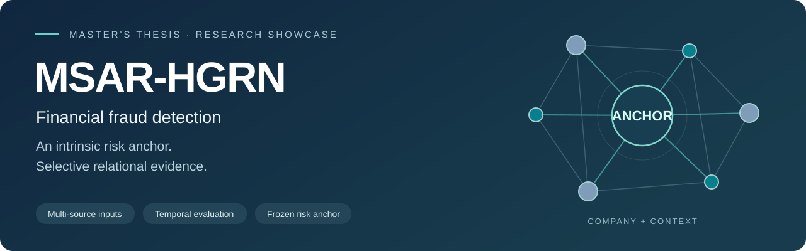
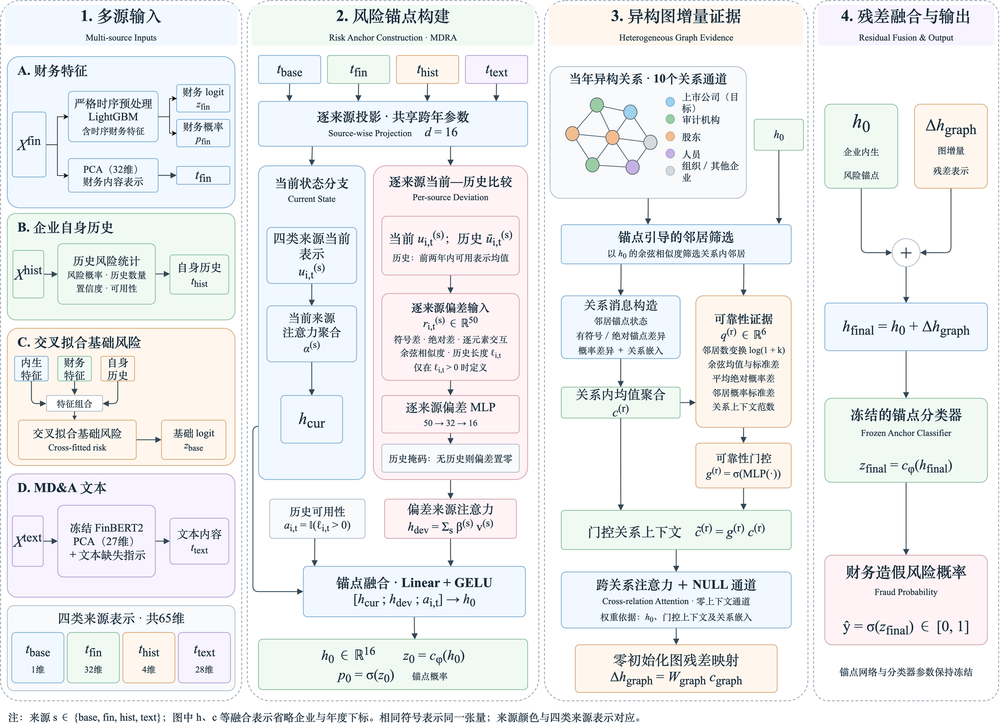
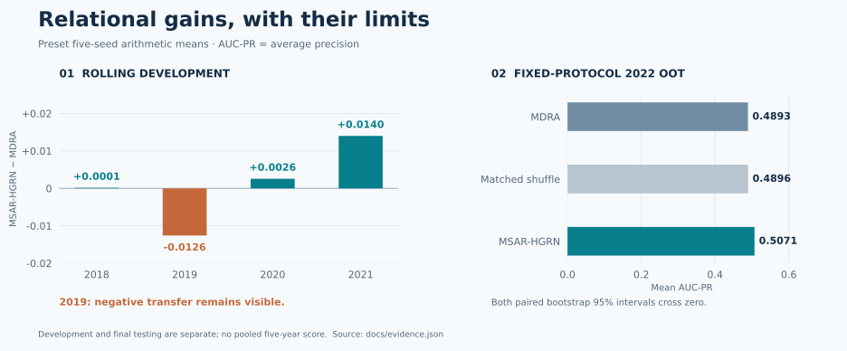

<div align="center">



# MSAR-HGRN

Multi-Source Anchor-Guided Risk-Aware Heterogeneous Graph Residual Network

**[English](README.md) · [中文](README_CN.md)**

[Method](#method) · [Evidence](#evidence) · [Run the demo](#run-the-demo) · [Research status](docs/research_status.md)

</div>

A master's thesis research showcase by [周文杰 · RookieZhou0617](https://github.com/RookieZhou0617), Shanghai University of Finance and Economics.

> **The research question:** Once a company-level risk model is already strong, what useful evidence can heterogeneous relations still add?

This project builds a multi-source, current–history risk anchor (**MDRA**), then learns a selective graph residual on top of that frozen anchor (**MSAR-HGRN**). It studies financial-statement-fraud risk ranking on FiGraph under annual temporal evaluation—not causal fraud attribution or a production decision system.

| Research setting | Evaluation | Current stage |
| :--- | :--- | :--- |
| Financial features + MD&A + self-history + cross-fitted risk | 2018–2021 rolling development; fixed-protocol 2022 OOT | Model frozen; five-chapter thesis draft under revision |

## Method

**Build the anchor → select relational evidence → learn a residual.**

1. **MDRA · Understand the company.** Compare each source's current state with the same company's available prior two years. Fuse current information, per-source deviations, and history availability.
2. **Graph residual · Add context selectively.** Select the top half of peers by frozen-anchor similarity, construct risk-relative messages, and combine relation-wise means through reliability gates and NULL-aware attention.
3. **Frozen prediction path · Preserve the starting point.** Add a zero-initialized hidden-state residual and reuse the frozen anchor classifier. Only the graph branch is trained in stage two.

[](assets/model-framework.png)

*Figure 3-1 from the current thesis, reused unchanged. Click for full resolution. [Detailed method](docs/methodology.md) · [Public implementation boundary](docs/implementation.md)*

The residual is exactly zero **at initialization**. Frozen parameters do not guarantee better future-year performance; the NULL channel can reduce reliance on relations but does not guarantee a zero learned residual.

## Evidence



### Fixed-protocol 2022 OOT

Same 5,132-company population, 123 positive cases. Primary results below are **arithmetic means over five preset seeds**, not metrics of averaged predictions. AUC-PR is computed as average precision.

| Model / control | AUC-PR ↑ | AUC-ROC ↑ | LogLoss ↓ | F1 @ 0.5 ↑ | Recall @ 5% ↑ |
| :--- | ---: | ---: | ---: | ---: | ---: |
| MDRA · intrinsic anchor | 0.489256 | 0.945054 | 0.056671 | **0.585282** | 0.809756 |
| MSAR-HGRN · real relations | **0.507052** | **0.947675** | **0.054272** | 0.576771 | **0.814634** |

Real relations improve mean AUC-PR by **+0.017797** over MDRA and **+0.017414** over the matched shuffled-relation control (AUC-PR 0.489639). Both paired comparisons are positive in 5/5 seeds.

> **Interpretation, not a victory claim.** Company-level paired bootstrap 95% intervals cross zero for both comparisons. The 2019 development fold shows negative transfer, and final F1 at 0.5 decreases relative to MDRA. This is directional evidence of relational increment, not statistical significance, uniform improvement, or established temporal robustness.

Six runnable external baselines are also reported, including LightGBM (AUC-PR 0.407467). Their input families differ from the thesis model; this is **not an input-matched architecture leaderboard**. The Source65 same-input control remains unavailable for 2022.

[Full results, uncertainty & baselines →](docs/experiments.md) · [Temporal protocol →](docs/strict_temporal_protocol.md) · [Reviewed aggregate numbers →](docs/evidence.json)

## Run the demo

```bash
git clone https://github.com/RookieZhou0617/risk-aware-financial-fraud-detection.git
cd risk-aware-financial-fraud-detection
python -m venv .venv
source .venv/bin/activate
pip install -r requirements.txt
python examples/synthetic_demo.py
python -m unittest discover -s tests -v
```

No dataset download, GPU, or graph-framework dependency is needed. The demo uses **entirely synthetic inputs and labels** to exercise zero-initialized residuals and one graph-only optimization step.

This is a compact educational implementation, **not a one-command reproduction of the thesis**. The synthetic anchor is randomly initialized and frozen; its loss is a software smoke check, not research evidence.

## Explore the repository

| Start here | What you will find |
| :--- | :--- |
| [Methodology](docs/methodology.md) | Source representations, history deviations, graph residual and training boundary |
| [Evaluation](docs/experiments.md) | Development heterogeneity, final controls, six baselines, uncertainty |
| [Temporal protocol](docs/strict_temporal_protocol.md) | Selection / refit windows and historical-label availability assumptions |
| [Implementation guide](docs/implementation.md) | Model-to-code map and explicit differences from the research implementation |
| [Research & writing status](docs/research_status.md) | Frozen experiments, thesis naming, manuscript progress and branch roles |
| [Model components](src/models/) · [Synthetic example](examples/) | Readable PyTorch components and executable demonstration |
| [Visual assets](assets/) | Original thesis figure, cover, result chart and rendering instructions |

## Data, scope & attribution

The study uses [FiGraph](https://github.com/XiaoguangWang23/FiGraph); see the [dataset paper](https://doi.org/10.1145/3701716.3715301). Data is not redistributed. Obtain it from the official source and follow the authors' license and usage terms.

This repository publishes reviewed aggregate results, methodology, compact code and synthetic examples. It excludes company-level data, labels, predictions, checkpoints, full experiment artifacts, private logs and thesis drafts. No post-OOT retuning is performed.

**License status:** no open-source license has been granted for this repository yet; licensing will be clarified with the final thesis release. No ownership is claimed over FiGraph or other third-party resources.

---

<sub>Research snapshot: 2026-10-01 · Experiment IDs D3 / F0 remain unchanged in source evidence; public thesis names are MDRA / MSAR-HGRN.</sub>
