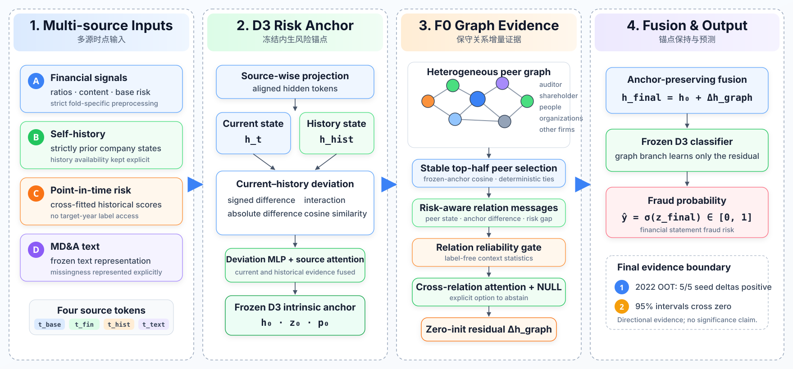

# 基于多源风险感知图网络的财务造假检测

本仓库是上海财经大学应用统计硕士论文研究的公开展示版，面向风控算法、数据科学与图学习相关岗位。它不是完整论文复现仓库，而是对最终模型思想、严格时序方法和核心工程实现的独立整理。

> **当前状态：** 模型探索已经关闭。最终冻结框架为 **D3＋F0**：D3 是多源当前—历史偏离内生风险锚点，F0 是保守的锚点保持型关系图残差。唯一一次固定协议 2022 OOT 评估已经完成，结果产生后不再允许修改模型。

## 研究问题

财务造假不仅与企业自身财务和文本信号有关，也可能通过股东、审计机构、关联交易、投资、供应链及人员组织关系形成风险关联。但直接使用图神经网络容易传播噪声邻居信息，破坏已经稳定的企业内生风险表示。

本研究关注的问题是：如何在强多源风险锚点之上，引入有用的增量关系证据，同时限制图信息造成的负迁移？

## 最终框架

$$
h_{\mathrm{final}}=h_{\mathrm{D3}}+\Delta h_{\mathrm{F0}}.
$$

- D3 多源风险锚点：融合财务特征、MD&A 文本表示、企业历史和严格时点可用的风险信号；
- 当前—历史偏离：建模有符号差、绝对差、逐元素交互与余弦相似度；
- 稳定邻居选择：按冻结锚点余弦相似度保留每类关系中前 `ceil(n/2)` 个邻居，并固定并列排序；
- 风险感知关系消息：同时利用邻居状态、目标—邻居差异和内生风险差；
- 低容量关系可靠性门：根据无标签的邻居与上下文统计抑制不可靠关系；
- 跨关系注意力与显式 NULL 关系：在没有可靠关系时允许放弃图修正；
- 零初始化隐藏层图残差：初始时精确保留 D3，训练 F0 时冻结 D3，只学习增量关系修正。

## 模型架构



## 严格时序评估

金融任务不能简单随机切分。本研究采用 expanding-window 开发折，所有预处理、表示、历史风险与图构造均遵守 fold-specific 因果边界。模型探索在读取最终 2022 结果前已经关闭；最终固定协议使用 2016–2020 进行选择训练、2021 验证、2016–2021 重拟合，2022 仅用于终局 OOT 评估。

## 最终证据

2018–2021 开发期 F0 相对 D3 的 AUC-PR 差值依次为 `+0.000142`、`-0.012589`、`+0.002565`、`+0.014009`，四年均值约 `+0.001032`。这说明 F0 存在真实年度异质性，不能表述为跨年一致优于 D3。

最终 2022 OOT 的五 seed 平均 AUC-PR 为：

| 冻结模型 | 平均 AUC-PR | 差值 |
|---|---:|---:|
| D3 内生风险锚点 | 0.489256 | — |
| F0 真实关系图残差 | 0.507052 | 相对 D3 `+0.017797` |
| F0 匹配乱序关系 | 0.489639 | 真实关系相对乱序 `+0.017414` |

两个比较均为 **5/5 seeds 正向**。但配对 bootstrap 95% 区间分别为 `[-0.017470, 0.056282]` 与 `[-0.017450, 0.055039]`，均跨 0。因此只能表述为方向一致的正向 OOT 证据，但效应估计仍有较大不确定性；不能宣称统计显著或已经证明时序稳健性。

ensemble 结果中，F0 的 AUC-PR 为 `0.507894`，D3 为 `0.492451`；F0 的 AUC-ROC 与 LogLoss 更好，但 Recall@5% 从 `0.821138` 降至 `0.813008`，Recall@10% 同为 `0.878049`，因此也不能宣称所有指标全面提升。

## 主要结论

1. 强内生风险表示应当避免被无约束图传播覆盖；
2. 真实关系结构能够提供超出内生锚点的增量风险信息；
3. 关系效用会随企业、关系和时间变化，不能忽略年度负迁移；
4. 最终保留的是冻结 D3 上的保守隐藏层图残差，而不是更复杂的 selector、attention 或时序修复模块；
5. 最终 OOT 支持 D3＋F0 的正向方向，但置信区间和指标权衡限制了结论强度。

## 快速运行

```bash
python -m venv .venv
source .venv/bin/activate
pip install -r requirements.txt
python examples/synthetic_demo.py
```

该示例完全使用合成公司特征、历史、关系和标签，只验证公开版 D3＋F0 的 forward、稳定邻居选择、loss 与一次图分支优化，不复现论文正式结果。

## 数据与公开边界

研究基于 [FiGraph 官方仓库](https://github.com/XiaoguangWang23/FiGraph)及其[论文](https://doi.org/10.1145/3701716.3715301)。本仓库不重新分发 FiGraph 数据，请从原作者或官方来源获取并遵守其许可与使用条款。

公开仓库不包含原始或预处理数据、逐样本预测、标签、checkpoint、完整实验日志、私有论文产物、论文草稿或内部研究提示词。这里的代码是最终设计的紧凑重实现，不是私有论文流水线的一键复现副本。
